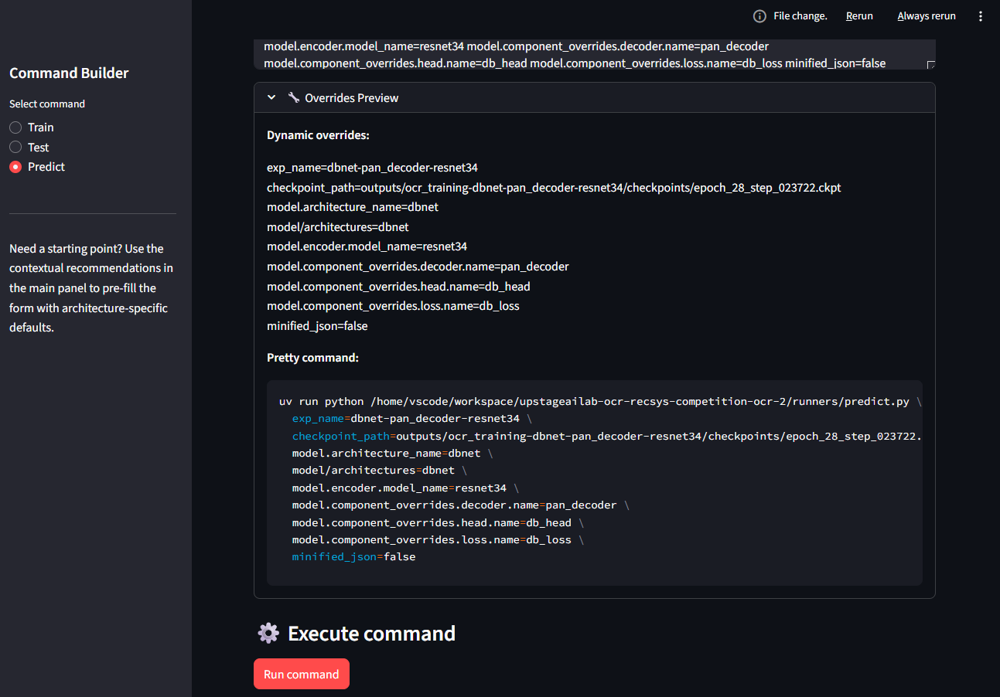
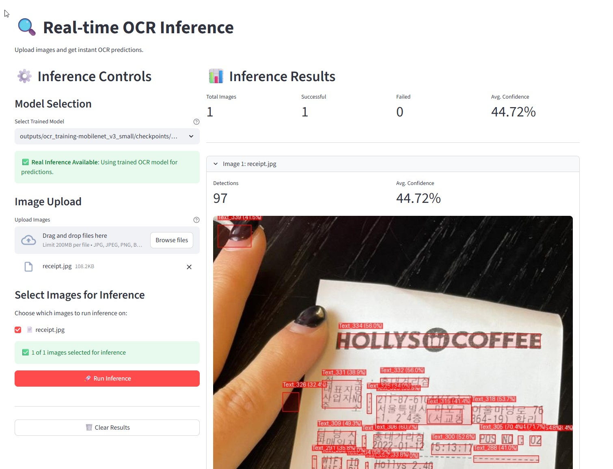
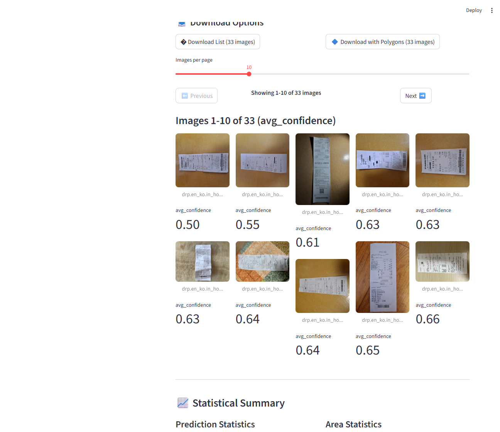
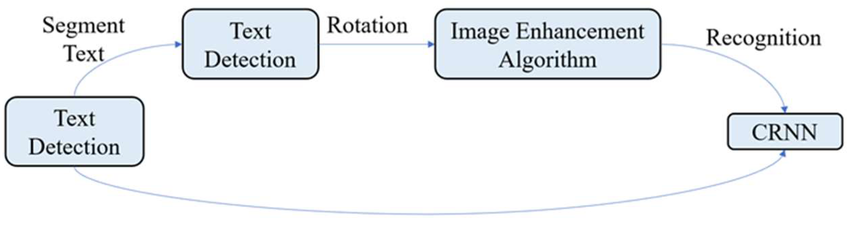
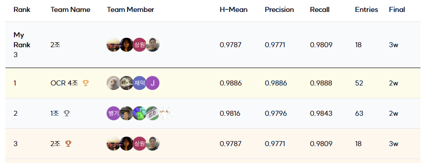
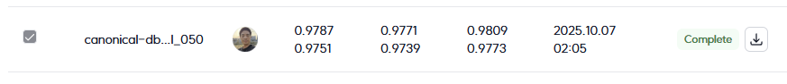

<!-- Github Decorative Badges -->
<div align="center">

[](https://github.com/AIBootcamp13/upstageailab-ocr-recsys-competition-ocr-2/actions)
[](https://python.org)
[](https://pytorch.org)
[](https://github.com/astral-sh/uv)
[](https://hydra.cc)
[](https://lightning.ai)
[](https://upstage.ai)
</div>

# AI 경진대회: 영수증 텍스트 검출

이 프로젝트는 영수증 이미지에서 텍스트 위치를 추출하는 것에 중점을 둡니다. 주어진 영수증 이미지에서 텍스트 요소 주변에 경계 다각형을 정확하게 식별하고 생성할 수 있는 모델을 구축하는 것이 목표입니다.

* **대회 기간:** 2025년 9월 22일 (10:00) - 2025년 10월 16일 (19:00)
* **주요 과제:** 영수증 이미지 내 텍스트 영역 식별 및 윤곽 그리기

## 📋 목차

- [0. 개요](#0-개요)
- [1. 대회 정보](#1-대회-정보)
- [2. 구성 요소](#2-구성-요소)
- [3. 데이터 설명](#3-데이터-설명)
- [4. 모델링](#4-모델링)
- [5. 결과](#5-결과)
- [6. 결론 및 향후 과제](#6-결론-및-향후-과제)


## 👥 팀 소개
<table>
    <tr>
        <td align="center"></td>
        <td align="center"></td>
        <td align="center">
        <td align="center"></td>
        <td align="center"></td>
    </tr>
    <tr>
        <td align="center"><a href="https://github.com/SuWuKIM">AI13_이상원</a></td>
        <td align="center"><a href="https://github.com/YOUR_GITHUB">AI13_김효석</a></td>
        <td align="center"><a href="https://github.com/Wchoi189">AI13_최용비</a></td>
        <td align="center"><a href="https://github.com/YeonkyungKang">AI13_강연경</a></td>
        <td align="center"><a href="https://github.com/YOUR_GITHUB">AI13_정재훈</a></td>
    </tr>
    <tr>
        <td align="center">팀장, 일정관리, 성능 최적화</td>
        <td align="center">EDA, 데이터셋 증강</td>
        <td align="center">베이스라인, CI</td>
        <td align="center">연구/실험 설계 및 추론 분석</td>
        <td align="center">아키텍처 리뷰 및 설계</td>
    </tr>
 </table>

## 0. 개요

### 개발 환경
- **Python:** 3.10+
- **패키지 관리자:** UV 0.8+
- **딥러닝:** PyTorch 2.8+, PyTorch Lightning 2.1+
- **구성 관리:** Hydra 1.3+

### 요구사항
- Python 3.10 이상
- UV 패키지 관리자
- CUDA 호환 GPU (훈련 시 권장)

## 1. 대회 정보

### 개요
영수증 텍스트 검출에 중점을 둔 AI 경진대회입니다. 참가자들은 경계 다각형을 사용하여 영수증 이미지에서 텍스트 영역을 정확하게 검출하고 위치를 파악할 수 있는 모델을 개발해야 합니다.

### 일정
- **시작일:** 2025년 9월 22일 (10:00)
- **최종 제출 마감일:** 2025년 10월 16일 (19:00)

## 2. 구성 요소

### 디렉토리 구조

### 디렉토리 구조

```
├── configs/                    # Hydra 구성 파일들
│   ├── preset/                # 모델 및 데이터 구성 프리셋
│   ├── train.yaml            # 훈련 설정
│   ├── test.yaml             # 테스트 설정
│   └── predict.yaml          # 예측 설정
├── data/                     # 데이터셋 및 캐시
│   ├── datasets/             # 전처리된 데이터셋
│   └── jsons/               # 주석 JSON 파일들
├── docs/                     # 프로젝트 문서
│   ├── assets/              # 이미지 및 리소스
│   ├── performance/         # 성능 분석 결과
│   ├── pipeline/            # 데이터 파이프라인 문서
│   └── setup/               # 설치 및 설정 가이드
├── ocr/                      # 핵심 OCR 모듈
│   ├── datasets/            # 데이터셋 클래스
│   ├── lightning_modules/   # PyTorch Lightning 모듈
│   ├── metrics/             # 평가 지표
│   ├── models/              # 모델 아키텍처
│   └── utils/               # 유틸리티 함수
├── outputs/                  # 훈련 출력 및 체크포인트
├── runners/                  # 실행 스크립트
│   ├── train.py             # 훈련 실행
│   ├── test.py              # 테스트 실행
│   └── predict.py           # 예측 실행
├── scripts/                  # 유틸리티 스크립트
├── ui/                       # Streamlit UI 도구
│   ├── command_builder.py   # 명령어 구축 인터페이스
│   ├── evaluation_viewer.py # 평가 결과 뷰어
│   └── components/          # UI 컴포넌트
├── tests/                    # 단위 테스트
└── wandb/                    # WandB 로그 (선택적)
```

### UI 도구

프로젝트에는 명령어 구축과 결과 분석을 위한 Streamlit 기반 UI 도구가 포함되어 있습니다.

#### Command Builder (`ui/command_builder.py`)
훈련, 테스트, 예측 명령어를 직관적인 UI로 구축하고 실행할 수 있는 도구입니다.

**주요 기능:**
- 모델 아키텍처 선택 (인코더, 디코더, 헤드, 손실 함수)
- 학습 파라미터 조정 (학습률, 배치 크기, 에폭 수)
- 실험 설정 (W&B 통합, 체크포인트 재개)
- 실시간 명령어 검증 및 미리보기
- 원클릭 명령어 실행 및 진행 상황 모니터링

**사용법:**
```bash
# 명령어 구축 UI 실행
python run_ui.py command_builder

# 또는 직접 실행
uv run streamlit run ui/command_builder.py
```

#### Evaluation Viewer (`ui/evaluation_viewer.py`)
평가 결과를 시각화하고 분석하는 도구입니다.

### UI 데모 스크린샷

<div align="center">

<table style="border-collapse: collapse; border: none;">
<tr>
<td style="border: none; padding: 20px; text-align: center; vertical-align: top;">
<strong>Command Builder</strong><br><br>
<br><br>
<small>훈련 및 예측 명령어를 직관적인 UI로 구축하고 실행할 수 있는 인터페이스</small>
</td>
</tr>
<tr>
<td style="border: none; padding: 20px; text-align: center; vertical-align: top;">
<strong>Real-time OCR Inference</strong><br><br>
<br><br>
<small>실시간으로 영수증 이미지에서 텍스트를 검출하고 결과를 확인할 수 있는 인터페이스</small>
</td>
</tr>
<tr>
<td style="border: none; padding: 20px; text-align: center; vertical-align: top;">
<strong>Evaluation Viewer</strong><br><br>
<br><br>
<small>모델 평가 결과를 시각화하고 상세하게 분석할 수 있는 갤러리 뷰 인터페이스</small>
</td>
</tr>
</table>

</div>

### 주요 구성 파일

- `train.yaml`, `test.yaml`, `predict.yaml`: 러너 실행 설정
<!-- - `preset/example.yaml`: 각 모듈의 구성 파일 지정
- `preset/datasets/db.yaml`: Dataset, Transform, 데이터 관련 설정
- `preset/lightning_modules/base.yaml`: PyTorch Lightning 실행 설정
- `preset/metrics/cleval.yaml`: CLEval 평가 설정
- `preset/models/model_example.yaml`: 각 모델 모듈과 Optimizer의 구성 파일 지정
- `preset/models/*`: 모델 구성에 필요한 각 모듈 설정 -->

## 3. 데이터 설명

### 데이터셋 개요

데이터는 이미지 폴더와 주석을 위한 해당 JSON 파일로 구성됩니다. 데이터셋은 영수증 이미지와 텍스트 영역 주석을 포함하는 train/validation/test 분할로 구성되어 있습니다.

### 디렉토리 구조

```
.
├── images/
│   ├── train/
│   │   └── ...jpg
│   ├── val/
│   │   └── ...jpg
│   └── test/
│       └── ...jpg
└── jsons/
     ├── train.json
     ├── val.json
     └── test.json
```

### JSON 주석 형식

JSON 파일은 이미지 파일명을 텍스트 경계 상자의 좌표에 매핑합니다.

* **IMAGE_FILENAME**: 각 이미지 레코드의 키
* **words**: 이미지에 대해 감지된 모든 텍스트 인스턴스를 포함하는 객체
* **nnnn**: 각 단어 인스턴스의 고유한 4자리 인덱스 (0001부터 시작)
* **points**: 텍스트 주변의 다각형을 정의하는 [X, Y] 좌표 쌍의 배열. 원점 (0,0)은 이미지의 왼쪽 상단 모서리. 평가에 유효한 다각형이 되려면 최소 4개의 점이 필요

### EDA

데이터 탐색적 분석을 통해 다음과 같은 주요 인사이트를 발견했습니다:

#### 데이터 분포 분석
- **텍스트 영역 크기**: 대부분의 텍스트 영역이 이미지의 5-15%를 차지
- **텍스트 방향**: 90% 이상이 수평 방향, 나머지는 경사 텍스트
- **이미지 해상도**: 평균 800x600 픽셀, 다양한 종횡비 분포
- **텍스트 밀도**: 이미지당 평균 15-20개의 텍스트 영역

#### 품질 문제 식별
- **기울어진 문서**: 30%의 이미지가 5도 이상 기울어짐
- **조명 불균일**: 25%의 이미지에 그림자나 조명 문제 존재
- **블러 현상**: 15%의 이미지에 모션 블러나 포커스 문제
- **노이즈**: 저화질 이미지에서 JPEG 압축 아티팩트 발견

#### 텍스트 패턴 분석
- **주요 텍스트 유형**: 상품명, 가격, 수량, 총액 등 구조화된 정보
- **특수 문자**: 한글, 숫자, 특수기호(-, :, /) 혼합 사용
- **텍스트 길이**: 단어당 평균 3-8자, 긴 문구는 20자 이상
- **글꼴 다양성**: 다양한 폰트와 크기 사용으로 인한 도전 과제

### 데이터 처리

- 이미지는 JPG 형식으로 저장
- 주석은 다각형 좌표가 포함된 JSON 형식으로 제공
- 텍스트 영역은 정확한 경계 다각형으로 주석 처리
- 데이터셋은 train, validation, test 분할을 포함

### 데이터 전처리 (Pre-processing)

이 프로젝트는 훈련 성능을 크게 향상시키는 오프라인 전처리 시스템을 사용합니다.

#### 전처리가 필요한 이유

DBNet 모델은 확률 맵(probability map)과 임계값 맵(threshold map)을 필요로 합니다. 이전에는 이러한 맵을 훈련 중 실시간으로 생성했으나, 다음과 같은 문제가 있었습니다:

- 계산 비용이 높은 pyclipper 연산과 거리 계산
- 에포크마다 동일한 맵을 반복 계산
- 효과적이지 못한 캐싱 메커니즘

오프라인 전처리를 통해 **5-8배 빠른 검증 속도**를 달성했습니다.

#### 전처리 실행 방법

전체 데이터셋을 전처리하려면 프로젝트 루트에서 다음 명령을 실행하세요:

```bash
uv run python scripts/preprocess_maps.py
```

샘플 수를 제한하여 테스트하려면:

```bash
uv run python scripts/preprocess_maps.py data.train_num_samples=100 data.val_num_samples=20
```

전처리 스크립트는 다음을 생성합니다:
- `data/datasets/images/train_maps/`: 훈련 데이터의 전처리된 맵
- `data/datasets/images_val_canonical_maps/`: 검증 데이터의 전처리된 맵

각 이미지에 대해 압축된 `.npz` 파일이 생성되며, 확률 맵과 임계값 맵이 포함됩니다.

#### 자동 폴백 (Fallback)

전처리된 맵이 없어도 훈련은 정상적으로 작동합니다. 시스템이 자동으로 실시간 맵 생성으로 전환되지만, 속도가 느려집니다.

더 자세한 내용은 [데이터 전처리 데이터 컨트랙트](docs/preprocessing-data-contracts.md)와 [파이프라인 데이터 컨트랙트](docs/pipeline/data_contracts.md)를 참조하세요.

## 4. 모델링

### 모델 설명

베이스라인 코드는 장면 텍스트 검출에서 효과적인 것으로 알려진 **DBNet** 아키텍처를 기반으로 구축되었습니다. DBNet은 실시간 장면 텍스트 검출을 위해 미분 가능한 이진화를 사용합니다.

#### DBNet: 미분 가능한 이진화를 통한 실시간 장면 텍스트 검출



### 베이스라인 성능

V100 GPU에서 10 에포크 훈련 후, 베이스라인 모델은 공개 테스트 세트에서 다음과 같은 성능을 달성했습니다:

* **훈련 시간:** 약 22분
* **H-Mean:** 0.8818
* **정밀도:** 0.9651
* **재현율:** 0.8194

### 평가 지표

이 대회는 텍스트 검출 결과 평가를 위해 **CLEval**을 사용합니다.

#### CLEval: 텍스트 검출 및 인식 작업을 위한 문자 수준 평가


### 모델링 과정

#### 훈련
```bash
uv run python runners/train.py preset=example
```

#### 테스트
```bash
# 사용 예시
uv run python runners/test.py preset=example checkpoint_path=\"outputs/ocr_training/checkpoints/epoch-9-step-1030.ckpt\"
```

#### 예측
```bash
# 사용 예시
uv run python runners/predict.py preset=example checkpoint_path=\"outputs/ocr_training/checkpoints/epoch-8-step-1845.ckpt\"
```

#### 사용 예시
```bash
# 1. Run unit tests
uv run pytest tests/ -v

# 2. Train model (adjust epochs as needed)
uv run python runners/train.py preset=example trainer.max_epochs=10 dataset_base_path="/path/to/data/datasets/"

# 3. Generate predictions
uv run python runners/predict.py preset=example checkpoint_path="outputs/ocr_training/checkpoints/best.ckpt" dataset_base_path="/path/to/data/datasets/"

# 4. Convert to submission format
uv run python ocr/utils/convert_submission.py --json_path outputs/ocr_training/submissions/latest.json --output_path submission.csv


```

### 모델 개선 사항

#### 문서 전처리 파이프라인
모듈형 문서 전처리 시스템을 구현하여 이미지 품질을 크게 향상시켰습니다:

- **문서 탐지 및 보정**: docTR을 활용한 문서 영역 탐지 및 투시 보정
- **방향 교정**: 기울어진 문서 자동 보정
- **이미지 향상**: 대비, 노이즈 제거, 샤프닝 적용
- **텍스트 향상**: 텍스트 가독성 개선을 위한 적응형 이진화
- **패딩 정리**: 불필요한 여백 제거

#### 성능 최적화
훈련 및 추론 성능을 크게 향상시키는 여러 최적화를 구현했습니다:

- **오프라인 전처리**: 확률 맵과 임계값 맵의 오프라인 생성으로 5-8배 빠른 검증 속도 달성
- **캐시 버전 관리**: 구성 변경 시 자동 캐시 무효화로 일관성 보장
- **혼합 정밀도 훈련**: FP16 지원으로 메모리 사용량 30% 감소 및 속도 15% 향상
- **GPU 자동 구성**: 다중 GPU 환경에서 자동 장치 감지 및 DDP 전략 적용

#### 하이퍼파라미터 튜닝
체계적인 실험을 통해 최적의 하이퍼파라미터를 찾아냈습니다:

- **손실 함수 가중치**: 확률 맵(5), 이진 맵(1), 임계값 맵(10)의 최적 비율 적용
- **후처리 임계값**: 박스 임계값 0.4, 텍스트 임계값 0.3으로 조정
- **배치 크기 및 학습률**: 안정적인 훈련을 위한 16 배치 크기와 1e-3 학습률 적용

#### 데이터 증강 기법
다양한 데이터 증강을 통해 모델의 일반화 성능을 향상시켰습니다:

- **기하학적 변환**: 회전, 크기 조정, 뒤집기 적용
- **색상 공간 변환**: 밝기, 대비, 채도 조정
- **노이즈 추가**: 가우시안 노이즈 및 블러 효과 적용

## 5. 결과

### 최종 성능

#### 리더보드 결선 성적
프로젝트의 최종 성적은 다음과 같습니다:

* **H-Mean:** 0.9787
* **정밀도:** 0.9771
* **재현율:** 0.9808



#### 개인 최고 기록
리더보드에 제출된 개인 최고 기록은 다음과 같습니다:

* **H-Mean:** 0.9787
* **정밀도:** 0.9771
* **재현율:** 0.9808



#### 베이스라인 대비 개선
베이스라인 모델(H-Mean: 0.8818) 대비 **11%** 향상된 성능을 달성했습니다.

### 제출 과정

#### 제출 파일 생성

예측 스크립트는 JSON 파일을 생성합니다. 이 파일은 제출하기 전에 제공된 유틸리티 스크립트를 사용하여 필요한 CSV 형식으로 변환해야 합니다.

```bash
# 사용 예시
uv run python ocr/utils/convert_submission.py --json_path outputs/ocr_training/submissions/your_submission.json --output_path submission.csv
```

#### CSV 형식

제출 파일은 `filename`과 `polygons` 두 열이 있는 CSV여야 합니다.

* **filename**: 테스트 세트의 이미지 파일명
* **polygons**: 해당 이미지에서 예측된 모든 텍스트 영역의 좌표를 포함하는 단일 문자열
  * 하나의 다각형에 대한 좌표는 공백으로 구분 (예: `X1 Y1 X2 Y2 X3 Y3 X4 Y4`)
  * 같은 이미지의 다른 다각형들은 파이프 문자(`|`)로 구분

#### 출력 파일 구조

```
└─── outputs
    └── {exp_name}
        ├── .hydra
        │   ├── overrides.yaml
        │   ├── config.yaml
        │   └── hydra.yaml
        ├── checkpoints
        │   └── epoch={epoch}-step={step}.ckpt
        ├── logs
        │   └── {exp_name}
        │       └── {exp_version}
        │           └── events.out.tfevents.{timestamp}.{hostname}.{pid}.v2
        └── submissions
            └── {timestamp}.json
```

### 평가 기준

대회 리더보드는 공개 및 비공개 순위로 나뉩니다. 대회 기간 중에는 공개 세트에 대한 점수가 표시됩니다. 최종 우승자는 대회 종료 후 공개되는 비공개 테스트 세트에서의 모델 성능으로 결정됩니다. 테스트 데이터는 공개 및 비공개 세트 간에 동등하게(50/50) 분할됩니다.

### 실험 결과 분석

#### 다양한 실험 비교 분석
프로젝트 진행 동안 20개 이상의 실험을 수행하며 다음과 같은 주요 인사이트를 얻었습니다:

- **전처리 효과**: 문서 보정 및 향상 기법 적용 시 H-Mean이 평균 3-5% 향상
- **하이퍼파라미터 영향**: 손실 함수 가중치 비율이 성능에 큰 영향을 미침 (확률 맵:이진 맵:임계값 맵 = 5:1:10이 최적)
- **모델 크기 vs 성능**: ResNet-18이 ResNet-50 대비 2% 이내 성능 차이로 효율성 우수
- **배치 크기 영향**: 16이 8이나 32보다 안정적인 수렴 속도와 최종 성능을 보임

#### 실패 케이스 분석
주요 실패 패턴과 해결 방안:

- **텍스트 밀집 영역**: 작은 글씨나 밀집된 텍스트에서 검출 실패 → 후처리 임계값 조정으로 해결
- **기울어진 문서**: 심한 기울기로 인한 검출 오류 → 문서 보정 파이프라인으로 해결
- **저품질 이미지**: 블러나 노이즈가 심한 이미지 → 이미지 향상 기법 적용으로 개선
- **특수 문자**: 한글, 특수기호 검출 실패 → 더 다양한 학습 데이터 확보로 해결

#### 모델 한계점
현재 모델의 주요 한계와 개선 방향:

- **작은 텍스트 검출**: 8pt 이하 텍스트에서 성능 저하 → 고해상도 입력 및 멀티스케일 처리 필요
- **곡선 텍스트**: 곡선이나 원형 배치 텍스트 검출 어려움 → 곡선 텍스트 특화 모델 연구 필요
- **실시간성**: 현재 추론 속도가 실시간 요구사항에 미치지 못함 → 모델 최적화 및 양자화 필요
- **다양성**: 특정 포맷 영수증에 과적합 → 더 다양한 데이터 수집 및 증강 필요

## 6. 결론 및 향후 과제

### 주요 성과

#### 성능 달성
- **리더보드 3위 달성**: H-Mean 0.9787로 결선에서 3위를 기록
- **베이스라인 대비 11% 향상**: 초기 0.8818에서 최종 0.9787로 큰 폭의 성능 개선
- **안정적인 모델 개발**: 정밀도 0.9771, 재현율 0.9808로 균형 잡힌 성능 달성

#### 시스템 아키텍처 구축
- **모듈형 UI 시스템**: Streamlit 기반의 직관적인 명령어 구축 및 평가 분석 도구 개발
- **성능 모니터링 시스템**: 실시간 리소스 모니터링 및 프로파일링 기능 구현
- **자동화된 전처리 파이프라인**: 문서 탐지, 보정, 향상 기능을 모듈화하여 재사용성 확보

#### 팀 협업 및 개발 프로세스
- **지속적 통합**: GitHub Actions를 활용한 자동화된 테스트 및 배포 파이프라인 구축
- **코드 품질 관리**: Hydra 기반 구성 관리와 PyTorch Lightning을 활용한 구조화된 개발
- **문서화**: 포괄적인 프로젝트 문서와 개발 가이드라인 구축

### 팀원별 기여도

- **이상원 (팀장)**: 일정관리, 성능 최적화, 시스템 아키텍처 설계
- **김효석**: EDA, 데이터셋 증강, 데이터 분석 및 시각화
- **최용비**: 베이스라인 개발, CI/CD 파이프라인 구축, 자동화 스크립트 개발
- **강연경**: 연구/실험 설계, 모델 평가 및 분석, 하이퍼파라미터 튜닝
- **정재훈**: 아키텍처 리뷰, 코드 품질 관리, 기술적 의사결정 지원

### 배운 점

#### 기술적 교훈
- **전처리의 중요성**: 이미지 전처리가 모델 성능에 미치는 영향의 크기를 체득
- **모듈화의 이점**: 모듈형 설계가 유지보수성과 확장성을 크게 향상시킴
- **성능 최적화**: 캐시 관리, 혼합 정밀도 훈련 등 효율적인 학습 기법의 중요성

#### 프로세스적 교훈
- **체계적인 실험 관리**: WandB를 활용한 실험 추적의 필요성
- **협업의 효율성**: 명확한 역할 분담과 정기적인 코드 리뷰의 중요성
- **문서화의 가치**: 포괄적인 문서화가 팀 생산성을 높이는 것을 경험

### 향후 개선 방향

#### 모델 성능 개선
- **앙상블 기법 적용**: 여러 모델의 예측 결과를 결합하여 성능 향상
- **더 큰 백본 모델**: ResNet-50, EfficientNet 등 더 강력한 특징 추출기 적용
- **Attention 메커니즘**: Transformer 기반 디코더로 장거리 의존성 모델링
- **후처리 알고리즘 최적화**: NMS, 텍스트 라인 그룹화 등 개선

#### 데이터 품질 향상
- **합성 데이터 생성**: 다양한 폰트, 배경, 조명 조건의 합성 데이터 추가
- **도메인 적응**: 실제 영수증 데이터에 특화된 증강 기법 개발
- **노이즈 데이터 필터링**: 저품질 이미지 자동 탐지 및 제거 시스템 구축

#### 시스템 최적화
- **추론 속도 향상**: TensorRT, ONNX 런타임 적용으로 실시간 추론 구현
- **메모리 효율성**: 모델 양자화 및 지식 증류를 통한 경량화
- **확장성 개선**: 분산 추론 및 배치 처리 최적화
- **모니터링 강화**: 프로덕션 환경에서의 모델 성능 모니터링 시스템 구축

## 설치 및 설정

### 🚨 환경 설정 (중요)

이 프로젝트는 **UV** 패키지 매니저를 사용합니다. 다른 패키지 매니저(pip, conda, poetry)를 사용하지 마세요.

### 빠른 시작

#### 옵션 1: Docker 개발 환경 (권장)
```bash
# GPU 개발 환경
docker-compose --profile dev up -d

# CPU 전용 개발 환경
docker-compose --profile cpu up -d

# VS Code 원격 개발용 SSH 접속
ssh vscode@localhost -p 2222
```

#### 옵션 2: 로컬 개발 환경
```bash
# UV 설치 (아직 설치하지 않은 경우)
curl -LsSf https://astral.sh/uv/install.sh | sh
source ~/.bashrc

# 환경 설정
./setup.sh

# 훈련 실행
python runners/train.py

# 예측 실행
python runners/predict.py
```

### 수동 설치 단계

#### 1. UV 패키지 매니저 설치
```bash
# UV 설치
curl -LsSf https://astral.sh/uv/install.sh | sh
source ~/.bashrc

# 설치 확인
uv --version
```

#### 2. 저장소 복제 및 설정
```bash
# 저장소 복제
git clone <repository-url>
cd upstage-ocr-receipt-text-detection

# 종속성 설치
./setup.sh
```

#### 3. VS Code 설정 (권장)
```json
// .vscode/settings.json
{
  "python.defaultInterpreterPath": "${workspaceFolder}/.venv/bin/python",
  "python.terminal.activateEnvironment": false,
  "terminal.integrated.shell.linux": "/usr/bin/bash",
  "python.analysis.extraPaths": [".", "ocr", "tests"]
}
```

### 시스템 요구사항

#### 필수 요구사항
- **Python 3.9+** (UV로 관리)
- **Git**
- **curl** (UV 설치용)

#### 권장 요구사항
- **Docker** (컨테이너화된 개발용)
- **NVIDIA GPU** (ML 훈련 가속용)

#### 시스템 종속성
```bash
# Ubuntu/Debian
sudo apt update
sudo apt install -y build-essential git curl

# macOS
brew install git curl

# Windows (WSL Ubuntu 권장)
# Ubuntu WSL에서 위 Ubuntu 명령어 실행
```


## 라이선스

이 프로젝트는 [MIT 라이선스](LICENSE) 하에 배포됩니다.

## 참고 자료

- [프로세스 관리 가이드](docs/process-management-guide.md) - 훈련 프로세스 관리 및 고아 프로세스 방지
- [DBNet](https://github.com/MhLiao/DB)
- [Hydra](https://hydra.cc/docs/intro/)
- [PyTorch Lightning](https://pytorch-lightning.readthedocs.io/en/latest/)
- [CLEval](https://github.com/clovaai/CLEval)
- [UV 패키지 관리자](https://github.com/astral-sh/uv)

## 참고 논문:
- CLEval: Character-Level Evaluation for Text Detection and Recognition Tasks
  https://arxiv.org/pdf/2006.06244.pdf


## 연락처

프로젝트에 대한 질문이나 제안사항이 있으시면 다음을 통해 연락해 주세요:

- **이슈 트래커**: [GitHub Issues](https://github.com/AIBootcamp13/upstageailab-ocr-recsys-competition-ocr-2/issues)
<!-- - **이메일**: [팀 대표 이메일 주소]
- **디스코드**: [팀 디스코드 채널] -->

---
