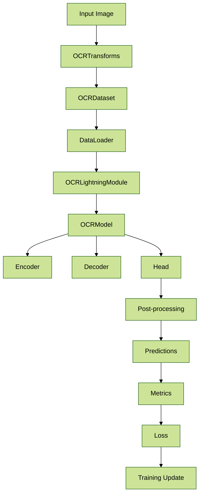

# Architecture Overview

## Current Architecture

The OCR framework currently implements a DBNet-based architecture for text detection, with a modular design that separates concerns into distinct components.

### 1. Component Structure

```
ocr/
├── models/
│   ├── architecture.py     # Main model assembly
│   ├── encoder/           # Feature extraction
│   │   └── timm_backbone.py
│   ├── decoder/           # Feature decoding
│   │   └── unet.py
│   ├── head/              # Task-specific heads
│   │   ├── db_head.py
│   │   └── db_postprocess.py
│   └── loss/              # Loss functions
│       ├── db_loss.py
│       ├── dice_loss.py
│       ├── bce_loss.py
│       └── l1_loss.py
├── lightning_modules/
│   └── ocr_pl.py          # PyTorch Lightning wrapper
├── datasets/              # Data handling
│   ├── base.py
│   ├── db_collate_fn.py
│   └── transforms.py
├── metrics/               # Evaluation metrics
│   ├── cleval_metric.py
│   └── eval_functions.py
└── utils/                 # Utilities
    └── ocr_utils.py
```

### 2. Data Flow



### 3. Key Components

#### Encoder (TimmBackbone)
- **Purpose**: Feature extraction from input images
- **Implementation**: Uses timm library for pre-trained backbones
- **Supported**: ResNet, EfficientNet, and other timm models
- **Configuration**: Backbone type, pretraining, freezing options

#### Decoder (UNet)
- **Purpose**: Feature map upsampling and refinement
- **Implementation**: U-Net architecture with skip connections
- **Features**: Multi-scale feature fusion, progressive upsampling

#### Head (DBNetHead)
- **Purpose**: Generate text region probability maps
- **Implementation**: DBNet-specific head with probability and threshold maps
- **Output**: Binary segmentation masks for text regions

#### Loss Functions
- **DBLoss**: Combined binary cross-entropy and dice loss
- **DiceLoss**: Dice coefficient-based loss for segmentation
- **BCELoss**: Binary cross-entropy loss
- **L1Loss**: L1 regularization loss

## Planned Plug-and-Play Architecture

The framework will be restructured to support multiple OCR architectures through a registry-based system with abstract interfaces.

### 1. Target Architecture Structure

```
src/
├── ocr_framework/
│   ├── architectures/     # Architecture implementations
│   │   ├── dbnet/
│   │   │   ├── __init__.py
│   │   │   ├── encoder.py
│   │   │   ├── decoder.py
│   │   │   ├── head.py
│   │   │   └── loss.py
│   │   ├── east/
│   │   ├── craft/
│   │   └── registry.py    # Architecture registry
│   ├── core/              # Core abstractions
│   │   ├── base_encoder.py
│   │   ├── base_decoder.py
│   │   ├── base_head.py
│   │   ├── base_loss.py
│   │   └── base_metric.py
│   ├── models/            # Model assembly
│   │   ├── factory.py     # Model factory
│   │   └── composite_model.py
│   ├── datasets/          # Data handling
│   │   ├── base_dataset.py
│   │   ├── transforms/
│   │   └── collate_fns/
│   ├── training/          # Training components
│   │   ├── lightning_modules/
│   │   └── callbacks/
│   ├── evaluation/        # Metrics and evaluation
│   │   ├── metrics/
│   │   └── evaluators/
│   ├── utils/             # Utilities
│   │   ├── logging/
│   │   ├── visualization/
│   │   └── config_utils.py
│   └── config/            # Configuration management
│       ├── schemas/
│       └── validators/
```

### 2. Abstract Base Classes

#### BaseEncoder
```python
from abc import ABC, abstractmethod
from typing import Dict, Any, Tuple
import torch
import torch.nn as nn


class BaseEncoder(nn.Module, ABC):
    """Abstract base class for all encoders."""

    def __init__(self, config: Dict[str, Any]):
        super().__init__()
        self.config = config

    @abstractmethod
    def forward(self, x: torch.Tensor) -> torch.Tensor:
        """Forward pass through encoder.

        Args:
            x: Input tensor [B, C, H, W]

        Returns:
            Encoded features [B, C', H', W']
        """
        pass

    @property
    @abstractmethod
    def output_channels(self) -> int:
        """Number of output channels."""
        pass

    @property
    @abstractmethod
    def output_stride(self) -> int:
        """Output stride relative to input."""
        pass
```

#### BaseDecoder
```python
class BaseDecoder(nn.Module, ABC):
    """Abstract base class for all decoders."""

    def __init__(self, config: Dict[str, Any]):
        super().__init__()
        self.config = config

    @abstractmethod
    def forward(self, encoder_features: torch.Tensor) -> torch.Tensor:
        """Forward pass through decoder.

        Args:
            encoder_features: Encoder output [B, C, H, W]

        Returns:
            Decoded features [B, C', H', W']
        """
        pass

    @abstractmethod
    def get_feature_maps(self) -> List[torch.Tensor]:
        """Get intermediate feature maps for skip connections."""
        pass
```

#### BaseHead
```python
class BaseHead(nn.Module, ABC):
    """Abstract base class for all heads."""

    def __init__(self, config: Dict[str, Any]):
        super().__init__()
        self.config = config

    @abstractmethod
    def forward(self, features: torch.Tensor) -> Union[torch.Tensor, Tuple[torch.Tensor, ...]]:
        """Forward pass through head.

        Args:
            features: Decoder output [B, C, H, W]

        Returns:
            Head predictions (format depends on task)
        """
        pass

    @abstractmethod
    def postprocess(self, predictions: Any, **kwargs) -> Dict[str, Any]:
        """Post-process predictions into final format.

        Args:
            predictions: Raw head predictions
            **kwargs: Additional post-processing parameters

        Returns:
            Processed predictions with polygons, scores, etc.
        """
        pass
```

#### BaseLoss
```python
class BaseLoss(nn.Module, ABC):
    """Abstract base class for all loss functions."""

    def __init__(self, config: Dict[str, Any]):
        super().__init__()
        self.config = config

    @abstractmethod
    def forward(self, predictions: Any, targets: Any) -> torch.Tensor:
        """Compute loss.

        Args:
            predictions: Model predictions
            targets: Ground truth targets

        Returns:
            Loss tensor
        """
        pass

    @abstractmethod
    def get_loss_components(self) -> Dict[str, torch.Tensor]:
        """Get individual loss components for logging."""
        pass
```

### 3. Architecture Registry

```python
from typing import Dict, Type, Any
from ocr_framework.core.base_encoder import BaseEncoder
from ocr_framework.core.base_decoder import BaseDecoder
from ocr_framework.core.base_head import BaseHead
from ocr_framework.core.base_loss import BaseLoss


class ArchitectureRegistry:
    """Registry for OCR architectures and components."""

    def __init__(self):
        self.encoders: Dict[str, Type[BaseEncoder]] = {}
        self.decoders: Dict[str, Type[BaseDecoder]] = {}
        self.heads: Dict[str, Type[BaseHead]] = {}
        self.losses: Dict[str, Type[BaseLoss]] = {}
        self.architectures: Dict[str, Dict[str, Any]] = {}

    def register_encoder(self, name: str, encoder_class: Type[BaseEncoder]):
        """Register an encoder implementation."""
        self.encoders[name] = encoder_class

    def register_decoder(self, name: str, decoder_class: Type[BaseDecoder]):
        """Register a decoder implementation."""
        self.decoders[name] = decoder_class

    def register_head(self, name: str, head_class: Type[BaseHead]):
        """Register a head implementation."""
        self.heads[name] = head_class

    def register_loss(self, name: str, loss_class: Type[BaseLoss]):
        """Register a loss implementation."""
        self.losses[name] = loss_class

    def register_architecture(self, name: str, config: Dict[str, Any]):
        """Register a complete architecture configuration."""
        self.architectures[name] = config

    def get_encoder(self, name: str) -> Type[BaseEncoder]:
        """Get encoder class by name."""
        return self.encoders[name]

    def get_decoder(self, name: str) -> Type[BaseDecoder]:
        """Get decoder class by name."""
        return self.decoders[name]

    def get_head(self, name: str) -> Type[BaseHead]:
        """Get head class by name."""
        return self.heads[name]

    def get_loss(self, name: str) -> Type[BaseLoss]:
        """Get loss class by name."""
        return self.losses[name]

    def get_architecture(self, name: str) -> Dict[str, Any]:
        """Get architecture configuration by name."""
        return self.architectures[name]


# Global registry instance
registry = ArchitectureRegistry()
```

### 4. Model Factory

```python
from typing import Dict, Any
from omegaconf import DictConfig
from ocr_framework.architectures.registry import registry
from ocr_framework.models.composite_model import CompositeModel


class ModelFactory:
    """Factory for creating OCR models."""

    @staticmethod
    def create_model(config: DictConfig) -> CompositeModel:
        """Create a model from configuration.

        Args:
            config: Model configuration

        Returns:
            Configured model instance
        """
        # Get component classes
        encoder_class = registry.get_encoder(config.encoder.type)
        decoder_class = registry.get_decoder(config.decoder.type)
        head_class = registry.get_head(config.head.type)
        loss_class = registry.get_loss(config.loss.type)

        # Instantiate components
        encoder = encoder_class(config.encoder)
        decoder = decoder_class(config.decoder)
        head = head_class(config.head)
        loss = loss_class(config.loss)

        # Create composite model
        model = CompositeModel(
            encoder=encoder,
            decoder=decoder,
            head=head,
            loss=loss
        )

        return model

    @staticmethod
    def create_from_architecture(name: str, **overrides) -> CompositeModel:
        """Create model from registered architecture.

        Args:
            name: Architecture name
            **overrides: Configuration overrides

        Returns:
            Configured model instance
        """
        base_config = registry.get_architecture(name)

        # Apply overrides
        config = OmegaConf.create(base_config)
        for key, value in overrides.items():
            OmegaConf.setattr(config, key, value)

        return ModelFactory.create_model(config)
```

### 5. Composite Model

```python
from typing import Dict, Any, Tuple, Union
import torch
import torch.nn as nn
from ocr_framework.core.base_encoder import BaseEncoder
from ocr_framework.core.base_decoder import BaseDecoder
from ocr_framework.core.base_head import BaseHead
from ocr_framework.core.base_loss import BaseLoss


class CompositeModel(nn.Module):
    """Composite model combining encoder, decoder, head, and loss."""

    def __init__(
        self,
        encoder: BaseEncoder,
        decoder: BaseDecoder,
        head: BaseHead,
        loss: BaseLoss
    ):
        super().__init__()
        self.encoder = encoder
        self.decoder = decoder
        self.head = head
        self.loss = loss

    def forward(self, x: torch.Tensor) -> Union[torch.Tensor, Tuple[torch.Tensor, ...]]:
        """Forward pass through the model.

        Args:
            x: Input tensor [B, C, H, W]

        Returns:
            Model predictions
        """
        # Encode
        encoder_features = self.encoder(x)

        # Decode
        decoder_features = self.decoder(encoder_features)

        # Head prediction
        predictions = self.head(decoder_features)

        return predictions

    def compute_loss(
        self,
        predictions: Any,
        targets: Any
    ) -> Tuple[torch.Tensor, Dict[str, torch.Tensor]]:
        """Compute loss and return components.

        Args:
            predictions: Model predictions
            targets: Ground truth targets

        Returns:
            Tuple of (total_loss, loss_components)
        """
        total_loss = self.loss(predictions, targets)
        components = self.loss.get_loss_components()

        return total_loss, components

    def postprocess(self, predictions: Any, **kwargs) -> Dict[str, Any]:
        """Post-process predictions.

        Args:
            predictions: Raw predictions
            **kwargs: Post-processing parameters

        Returns:
            Processed predictions
        """
        return self.head.postprocess(predictions, **kwargs)

    def get_model_info(self) -> Dict[str, Any]:
        """Get model information for logging."""
        return {
            "encoder": self.encoder.__class__.__name__,
            "decoder": self.decoder.__class__.__name__,
            "head": self.head.__class__.__name__,
            "loss": self.loss.__class__.__name__,
            "encoder_channels": self.encoder.output_channels,
            "encoder_stride": self.encoder.output_stride
        }
```

## Configuration Management

### 1. Hydra Configuration Structure

```
configs/
├── architectures/         # Architecture-specific configs
│   ├── dbnet.yaml
│   ├── east.yaml
│   └── craft.yaml
├── components/            # Component configurations
│   ├── encoders/
│   │   ├── timm_resnet.yaml
│   │   ├── timm_efficientnet.yaml
│   │   └── custom_cnn.yaml
│   ├── decoders/
│   │   ├── unet.yaml
│   │   ├── fpn.yaml
│   │   └── custom_decoder.yaml
│   ├── heads/
│   │   ├── db_head.yaml
│   │   ├── east_head.yaml
│   │   └── craft_head.yaml
│   └── losses/
│       ├── db_loss.yaml
│       ├── dice_loss.yaml
│       └── focal_loss.yaml
├── datasets/              # Dataset configurations
│   ├── icdar2015.yaml
│   ├── synthtext.yaml
│   └── custom_dataset.yaml
├── experiments/           # Experiment configurations
│   ├── baseline_training.yaml
│   ├── architecture_comparison.yaml
│   └── hyperparameter_sweep.yaml
└── defaults.yaml          # Default configuration
```

### 2. Example Architecture Configuration

```yaml
# configs/architectures/dbnet.yaml
defaults:
  - encoder: timm_resnet50
  - decoder: unet
  - head: db_head
  - loss: db_loss
  - _self_

architecture_name: dbnet
model:
  encoder:
    _target_: ocr_framework.architectures.dbnet.encoder.DBNetEncoder
    backbone: resnet50
    pretrained: true
    freeze_backbone: false
  decoder:
    _target_: ocr_framework.architectures.dbnet.decoder.DBNetDecoder
    in_channels: 2048
    out_channels: 256
  head:
    _target_: ocr_framework.architectures.dbnet.head.DBNetHead
    in_channels: 256
    out_channels: 1
  loss:
    _target_: ocr_framework.architectures.dbnet.loss.DBNetLoss
    weight_bce: 1.0
    weight_dice: 1.0
    weight_l1: 0.01
```

### 3. Experiment Configuration

```yaml
# configs/experiments/baseline_training.yaml
defaults:
  - architecture: dbnet
  - dataset: icdar2015
  - _self_

experiment:
  name: baseline_dbnet_icdar2015
  seed: 42

data:
  batch_size: 8
  num_workers: 4
  image_size: [512, 512]

training:
  max_epochs: 100
  learning_rate: 0.001
  weight_decay: 0.0001
  scheduler:
    type: cosine
    warmup_epochs: 10

logging:
  wandb:
    project: ocr-experiments
    tags: [baseline, dbnet, icdar2015]
```

## Benefits of Plug-and-Play Architecture

### 1. Modularity
- **Independent Components**: Each component can be developed and tested separately
- **Easy Swapping**: Change architectures by modifying configuration only
- **Code Reuse**: Common components can be shared across architectures

### 2. Extensibility
- **New Architectures**: Add new OCR methods without modifying existing code
- **Custom Components**: Implement custom encoders, decoders, heads, or losses
- **Research Friendly**: Easy to experiment with different combinations

### 3. Maintainability
- **Clear Interfaces**: Abstract base classes define clear contracts
- **Registry System**: Centralized component management
- **Configuration Driven**: Behavior controlled through configuration files

### 4. Testing and Validation
- **Component Testing**: Test individual components in isolation
- **Integration Testing**: Test component combinations
- **Automated Validation**: Configuration validation ensures compatibility

## Migration Strategy

### Phase 1: Core Abstractions
1. Create abstract base classes for all components
2. Implement registry system
3. Create model factory
4. Add configuration validation

### Phase 2: Component Migration
1. Migrate existing DBNet components to new structure
2. Update import paths and class names
3. Modify configuration files
4. Update tests

### Phase 3: New Architectures
1. Implement EAST architecture
2. Implement CRAFT architecture
3. Add additional encoders (EfficientNet, etc.)
4. Create comprehensive test suite

### Phase 4: Advanced Features
1. Add model composition features
2. Implement ensemble methods
3. Add architecture search capabilities
4. Create visualization tools

This architecture provides a solid foundation for extensible, maintainable OCR development with clear separation of concerns and plug-and-play capabilities.</content>
File: `/home/vscode/workspace/upstage-receipt-text-detection-dbnet-baseline/docs/architecture-overview.md
