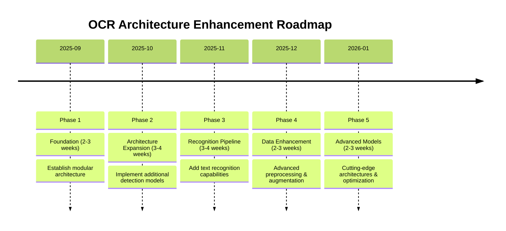
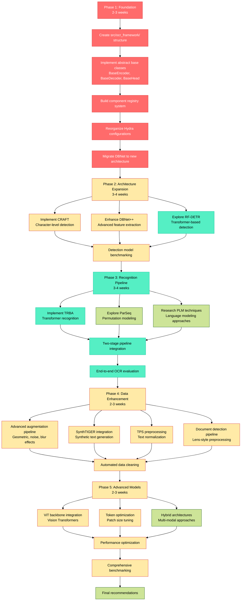
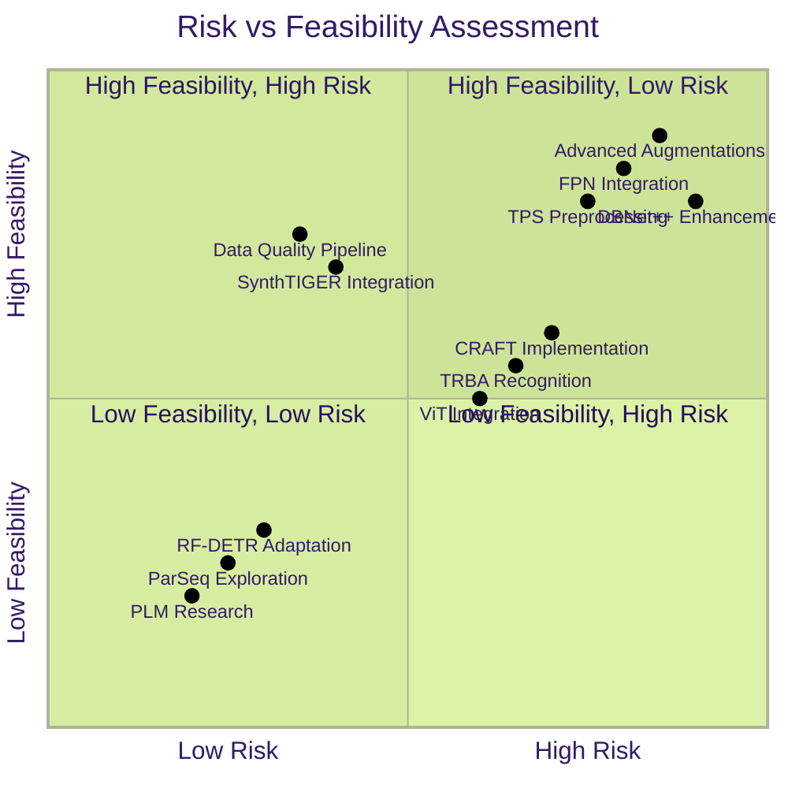
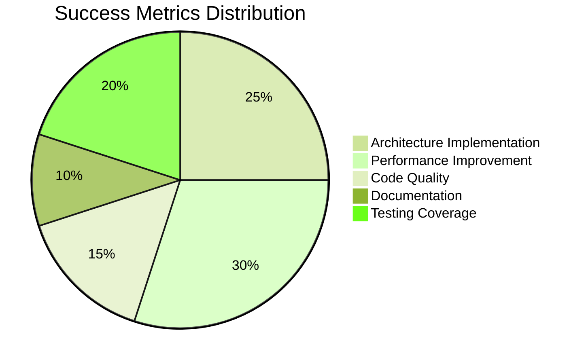

```mermaid
---
config:
  theme: "forest"
  timeline:
    disableMulticolor: true
---
%% Phase Overview Timeline
timeline
    title OCR Architecture Enhancement Roadmap
    2025-09 : Phase 1: Foundation (2-3 weeks)
           : Establish modular architecture
    2025-10 : Phase 2: Architecture Expansion (3-4 weeks)
           : Implement additional detection models
    2025-11 : Phase 3: Recognition Pipeline (3-4 weeks)
           : Add text recognition capabilities
    2025-12 : Phase 4: Data Enhancement (2-3 weeks)
           : Advanced preprocessing & augmentation
    2026-01 : Phase 5: Advanced Models (2-3 weeks)
           : Cutting-edge architectures & optimization
```

```mermaid
---
config:
  theme: "forest"
  timeline:
    disableMulticolor: true
---
%% Phase Overview Timeline
timeline
    title OCR Architecture Enhancement Roadmap
    2025-09 : Phase 1: Foundation (2-3 weeks)
           : Establish modular architecture
    2025-10 : Phase 2: Architecture Expansion (3-4 weeks)
           : Implement additional detection models
    2025-11 : Phase 3: Recognition Pipeline (3-4 weeks)
           : Add text recognition capabilities
    2025-12 : Phase 4: Data Enhancement (2-3 weeks)
           : Advanced preprocessing & augmentation
    2026-01 : Phase 5: Advanced Models (2-3 weeks)
           : Cutting-edge architectures & optimization
```

```mermaid
---
config:
  theme: "forest"
  timeline:
    disableMulticolor: true
---
%% Phase Overview Timeline
timeline
    title OCR Architecture Enhancement Roadmap
    2025-09 : Phase 1: Foundation (2-3 weeks)
           : Establish modular architecture
    2025-10 : Phase 2: Architecture Expansion (3-4 weeks)
           : Implement additional detection models
    2025-11 : Phase 3: Recognition Pipeline (3-4 weeks)
           : Add text recognition capabilities
    2025-12 : Phase 4: Data Enhancement (2-3 weeks)
           : Advanced preprocessing & augmentation
    2026-01 : Phase 5: Advanced Models (2-3 weeks)
           : Cutting-edge architectures & optimization
```

```mermaid
---
config:
  theme: "forest"
  timeline:
    disableMulticolor: true
---
%% Phase Overview Timeline
timeline
    title OCR Architecture Enhancement Roadmap
    2025-09 : Phase 1: Foundation (2-3 weeks)
           : Establish modular architecture
    2025-10 : Phase 2: Architecture Expansion (3-4 weeks)
           : Implement additional detection models
    2025-11 : Phase 3: Recognition Pipeline (3-4 weeks)
           : Add text recognition capabilities
    2025-12 : Phase 4: Data Enhancement (2-3 weeks)
           : Advanced preprocessing & augmentation
    2026-01 : Phase 5: Advanced Models (2-3 weeks)
           : Cutting-edge architectures & optimization
```

```mermaid
---
config:
  theme: "forest"
  timeline:
    disableMulticolor: true
---

%% Detailed Phase Breakdown
flowchart TD
    %% Phase 1: Foundation
    A1["Phase 1: Foundation<br/>2-3 weeks"] --> B1["Create src/ocr_framework/ structure"]
    B1 --> C1["Implement abstract base classes<br/>BaseEncoder, BaseDecoder, BaseHead"]
    C1 --> D1["Build component registry system"]
    D1 --> E1["Reorganize Hydra configurations"]
    E1 --> F1["Migrate DBNet to new architecture"]

    %% Phase 2: Architecture Expansion
    F1 --> A2["Phase 2: Architecture Expansion<br/>3-4 weeks"]
    A2 --> B2["Implement CRAFT<br/>Character-level detection"]
    A2 --> C2["Enhance DBNet++<br/>Advanced feature extraction"]
    A2 --> D2["Explore RF-DETR<br/>Transformer-based detection"]
    B2 --> E2["Detection model benchmarking"]
    C2 --> E2
    D2 --> E2

    %% Phase 3: Recognition Pipeline
    E2 --> A3["Phase 3: Recognition Pipeline<br/>3-4 weeks"]
    A3 --> B3["Implement TRBA<br/>Transformer recognition"]
    A3 --> C3["Explore ParSeq<br/>Permutation modeling"]
    A3 --> D3["Research PLM techniques<br/>Language modeling approaches"]
    B3 --> E3["Two-stage pipeline integration"]
    C3 --> E3
    D3 --> E3
    E3 --> F3["End-to-end OCR evaluation"]

    %% Phase 4: Data Enhancement
    F3 --> A4["Phase 4: Data Enhancement<br/>2-3 weeks"]
    A4 --> B4["Advanced augmentation pipeline<br/>Geometric, noise, blur effects"]
    A4 --> C4["SynthTIGER integration<br/>Synthetic text generation"]
    A4 --> D4["TPS preprocessing<br/>Text normalization"]
    A4 --> E4["Document detection pipeline<br/>Lens-style preprocessing"]
    B4 --> F4["Automated data cleaning"]
    C4 --> F4
    D4 --> F4
    E4 --> F4

    %% Phase 5: Advanced Models
    F4 --> A5["Phase 5: Advanced Models<br/>2-3 weeks"]
    A5 --> B5["ViT backbone integration<br/>Vision Transformers"]
    A5 --> C5["Token optimization<br/>Patch size tuning"]
    A5 --> D5["Hybrid architectures<br/>Multi-modal approaches"]
    B5 --> E5["Performance optimization"]
    C5 --> E5
    D5 --> E5
    E5 --> F5["Comprehensive benchmarking"]
    F5 --> G5["Final recommendations"]

    %% Styling and risk indicators
    classDef highPriority fill:#ff6b6b,stroke:#d63031,color:#fff
    classDef mediumPriority fill:#ffeaa7,stroke:#d63031,color:#000
    classDef lowPriority fill:#55efc4,stroke:#00b894,color:#000
    classDef highRisk fill:#fd79a8,stroke:#e84393,color:#fff
    classDef completed fill:#a29bfe,stroke:#6c5ce7,color:#fff

    class A1,B1,C1,D1,E1,F1 highPriority
    class A2,B2,C2,E2 mediumPriority
    class D2,A3,B3,E3,F3 lowPriority
    class A4,B4,C4,D4,E4,F4 mediumPriority
    class A5,B5,C5,E5,F5 mediumPriority
```

```mermaid
---
config:
  theme: "forest"
  timeline:
    disableMulticolor: true
---

%% Risk Assessment Matrix
quadrantChart
    title Risk vs Feasibility Assessment
    x-axis Low Risk --> High Risk
    y-axis Low Feasibility --> High Feasibility
    quadrant-1 High Feasibility, Low Risk
    quadrant-2 High Feasibility, High Risk
    quadrant-3 Low Feasibility, Low Risk
    quadrant-4 Low Feasibility, High Risk

    %% Quadrant 1: High Feasibility, Low Risk
    "DBNet++ Enhancement": [0.9, 0.8]
    "Advanced Augmentations": [0.85, 0.9]
    "FPN Integration": [0.8, 0.85]
    "TPS Preprocessing": [0.75, 0.8]

    %% Quadrant 2: High Feasibility, High Risk
    "CRAFT Implementation": [0.7, 0.6]
    "TRBA Recognition": [0.65, 0.55]
    "ViT Integration": [0.6, 0.5]

    %% Quadrant 3: Low Feasibility, Low Risk
    "SynthTIGER Integration": [0.4, 0.7]
    "Data Quality Pipeline": [0.35, 0.75]

    %% Quadrant 4: Low Feasibility, High Risk
    "RF-DETR Adaptation": [0.3, 0.3]
    "ParSeq Exploration": [0.25, 0.25]
    "PLM Research": [0.2, 0.2]

```

```mermaid
---
config:
  theme: "forest"
  timeline:
    disableMulticolor: true
---
%% Success Metrics Gauge
pie title Success Metrics Distribution
    "Architecture Implementation" : 25
    "Performance Improvement" : 30
    "Code Quality" : 15
    "Documentation" : 10
    "Testing Coverage" : 20
```
