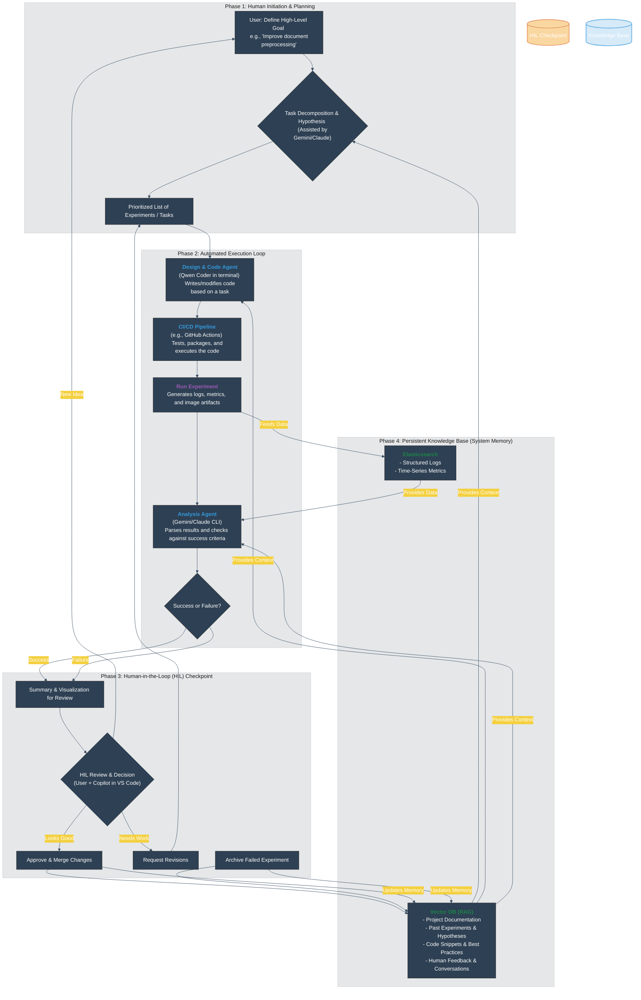

```mermaid
%%{init: {'theme': 'base', 'themeVariables': { 'primaryColor': '#2E4053', 'primaryTextColor': '#FFFFFF', 'lineColor': '#34495E', 'secondaryColor': '#F4D03F', 'tertiaryColor': '#E5E7E9'}}}%%
graph TD
    subgraph "Phase 1: Human Initiation & Planning"
        A["User: Define High-Level Goal <br> e.g., 'Improve document preprocessing'"]
        B{"Task Decomposition & Hypothesis <br> (Assisted by Gemini/Claude)"}
        C["Prioritized List of Experiments / Tasks"]
    end

    subgraph "Phase 2: Automated Execution Loop"
        D["<b style='color:#3498DB'>Design & Code Agent</b><br>(Qwen Coder in terminal) <br> Writes/modifies code based on a task"]
        E["<b style='color:#3498DB'>CI/CD Pipeline</b><br>(e.g., GitHub Actions) <br> Tests, packages, and executes the code"]
        F["<b style='color:#9B59B6'>Run Experiment</b><br>Generates logs, metrics, and image artifacts"]
        G["<b style='color:#3498DB'>Analysis Agent</b><br>(Gemini/Claude CLI)<br>Parses results and checks against success criteria"]
        H{"Success or Failure?"}
    end

    subgraph "Phase 3: Human-in-the-Loop (HIL) Checkpoint"
        I["Summary & Visualization for Review"]
        J{"HIL Review & Decision <br> (User + Copilot in VS Code)"}
        K["Approve & Merge Changes"]
        L["Request Revisions"]
        M["Archive Failed Experiment"]
    end

    subgraph "Phase 4: Persistent Knowledge Base (System Memory)"
        VDB["<b style='color:#1E8449'>Vector DB (RAG)</b><br>- Project Documentation<br>- Past Experiments & Hypotheses<br>- Code Snippets & Best Practices<br>- Human Feedback & Conversations"]
        ES["<b style='color:#1E8449'>Elasticsearch</b><br>- Structured Logs<br>- Time-Series Metrics"]
    end

    HIL[("HIL Checkpoint")]
    KB[("Knowledge Base")]

    %% Workflow Connections
    A --> B
    B --> C
    C --> D

    D --> E
    E --> F
    F --> G
    G --> H

    H -- "Success" --> I
    H -- "Failure" --> I

    I --> J

    J -- "Looks Good" --> K
    J -- "Needs Work" --> L
    J -- "New Idea" --> A

    L --> C

    K --> VDB
    M --> VDB

    %% Knowledge Base Connections (Feedback Loops)
    VDB -- "Provides Context" --> B
    VDB -- "Provides Context" --> D
    VDB -- "Provides Context" --> G
    ES -- "Provides Data" --> G

    F -- "Feeds Data" --> ES
    K -- "Updates Memory" --> VDB
    M -- "Updates Memory" --> VDB

    %% Styling
    style HIL fill:#FAD7A0,stroke:#E59866,stroke-width:2px
    style KB fill:#D6EAF8,stroke:#5DADE2,stroke-width:2px
```
