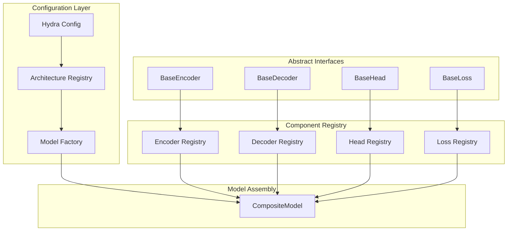
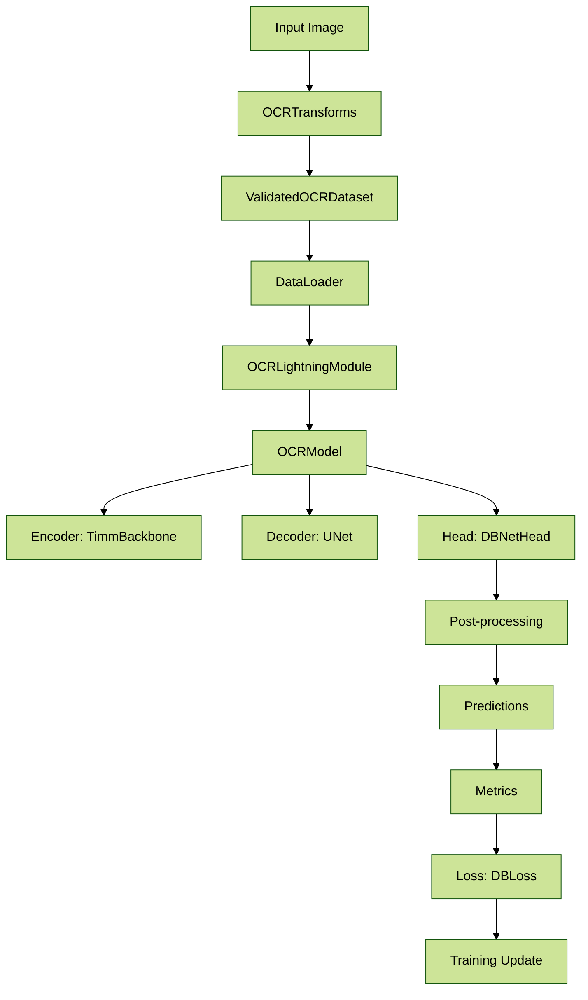

# **filename: docs/ai_handbook/03_references/architecture/01_architecture.md**
<!-- ai_cue:priority=high -->
<!-- ai_cue:use_when=architecture,design,system-overview -->

# **Reference: System Architecture**

This reference document provides comprehensive information about the OCR system's technical architecture, component design, and data flow patterns for quick lookup and detailed understanding.

## **Overview**

The OCR system is built as a modular, plug-and-play framework designed for rapid experimentation with different computer vision architectures. The system enables swapping components (encoders, decoders, heads) through configuration files with minimal code changes, using abstract base classes, component registries, and Hydra-based declarative configuration.

## **Key Concepts**

### **Plug-and-Play Framework**
The entire system is designed as a modular framework allowing rapid experimentation by swapping different components with minimal code changes, primarily driven by configuration files.

### **Component Registry**
A central catalog of all available components that can be assembled into complete models based on Hydra configurations.

### **Abstract Interfaces**
Common interfaces for each component type (encoders, decoders, heads, losses) ensuring interchangeability and consistency.

### **Model Factory**
A builder that assembles complete models from registered components based on declarative Hydra configurations.

## **Detailed Information**

### **Directory Structure**
The refactored codebase follows a src layout for clean separation of application code from project files.

```
src/
└── ocr_framework/
    ├── architectures/
    │   ├── dbnet/
    │   ├── east/
    │   └── registry.py
    ├── core/
    │   ├── base_encoder.py
    │   ├── base_decoder.py
    │   ├── base_head.py
    │   └── base_loss.py
    ├── models/
    │   ├── factory.py
    │   └── composite_model.py
    ├── datasets/
    ├── training/
    ├── evaluation/
    └── utils/
```

### **High-Level Component Diagram**
This diagram illustrates how the different parts of the framework interact. The configuration layer uses the registry to assemble a CompositeModel from various registered components that adhere to the abstract interfaces.



### **DBNet Data Flow Example**
This diagram shows the concrete data flow for the DBNet architecture, from input image to training update.



## **Examples**

### **Basic Usage**
```python
# Example of configuring a DBNet model
from ocr_framework.models.factory import create_model

config = {
    'architecture': 'dbnet',
    'encoder': {'name': 'resnet50', 'pretrained': True},
    'decoder': {'name': 'unet', 'channels': [256, 128, 64, 32]},
    'head': {'name': 'dbnet', 'k': 50}
}

model = create_model(config)
```

### **Advanced Usage**
```python
# Custom component registration
from ocr_framework.architectures.registry import register_encoder

@register_encoder('custom_encoder')
class CustomEncoder(BaseEncoder):
    def __init__(self, config):
        super().__init__(config)
        # Custom implementation
```

## **Configuration Options**

| Parameter | Type | Default | Description |
|-----------|------|---------|-------------|
| architecture | str | dbnet | Architecture type (dbnet, east, etc.) |
| encoder.name | str | resnet50 | Encoder backbone name |
| encoder.pretrained | bool | true | Use pretrained weights |
| decoder.name | str | unet | Decoder architecture name |
| decoder.channels | list | [256, 128, 64, 32] | Decoder channel dimensions |
| head.name | str | dbnet | Head architecture name |
| head.k | int | 50 | DBNet head parameter |

## **Best Practices**

- **Modular Design**: Always use abstract interfaces when implementing new components
- **Registry Usage**: Register all components in the appropriate registry for discoverability
- **Configuration First**: Prefer configuration-driven component selection over hardcoded choices
- **Interface Compliance**: Ensure all components implement the required abstract base class methods

## **Troubleshooting**

### **Common Issues**
- **Component Not Found**: Ensure the component is properly registered in the appropriate registry
- **Configuration Errors**: Validate Hydra config syntax and required parameters
- **Import Errors**: Check that all dependencies are installed and paths are correct

### **Debug Information**
- Enable debug logging: `export LOG_LEVEL=DEBUG`
- Check component registry: `python -c "from ocr_framework.architectures.registry import list_components; print(list_components())"`
- Validate configuration: `python -c "from omegaconf import OmegaConf; print(OmegaConf.to_yaml(config))"`

## **Related References**

- `docs/ai_handbook/03_references/architecture/02_hydra_and_registry.md` - Hydra configuration and component registry details
- `docs/ai_handbook/03_references/architecture/03_utility_functions.md` - Available utility functions
- `docs/ai_handbook/03_references/architecture/04_evaluation_metrics.md` - Evaluation metrics and scoring

---

*This document follows the references template. Last updated: 2025-01-15*
