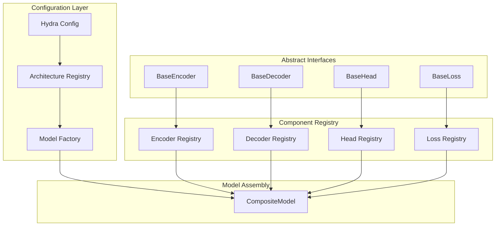
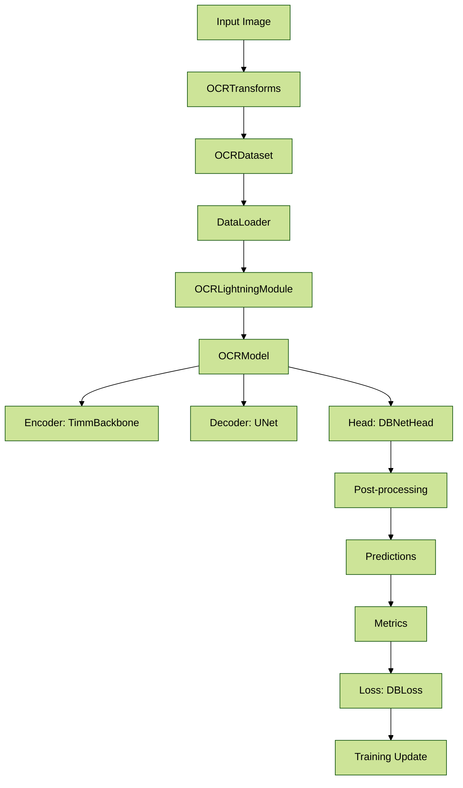

# **filename: docs/ai_handbook/03_references/01_architecture.md**

# **Reference: System Architecture**

This document provides the single source of truth for the project's technical architecture, from the high-level component design to the data flow of specific models like DBNet.

## **1. Core Concept: A Plug-and-Play Framework**

The entire system is designed as a modular, plug-and-play framework. The goal is to allow for rapid experimentation by swapping different components (e.g., encoders, decoders, heads) with minimal code changes, primarily driven by configuration files.

This is achieved through a combination of:

* **Abstract Base Classes:** Defining a common interface for each component type.
* **Component Registry:** A central catalog of all available components.
* **Model Factory:** A builder that assembles a complete model from registered components based on a Hydra config.
* **Hydra Configuration:** The declarative system for defining which components to use for an experiment.
* **UI Schemas:** Dynamic UI generation using YAML schemas located in `ui/apps/<app_name>/schemas/` for different UI components.

## **2. Target Directory Structure (src/)**

The refactored codebase follows a src layout for clean separation of application code from project files.

```
src/
└── ocr_framework/
    ├── architectures/
    │   ├── dbnet/
    │   ├── east/
    │   └── registry.py
    ├── core/
    │   ├── base_encoder.py
    │   ├── base_decoder.py
    │   ├── base_head.py
    │   └── base_loss.py
    ├── models/
    │   ├── factory.py
    │   └── composite_model.py
    ├── datasets/
    ├── training/
    ├── evaluation/
    └── utils/
```

## **3. High-Level Component Diagram**

This diagram illustrates how the different parts of the framework interact. The configuration layer uses the registry to assemble a CompositeModel from various registered components that adhere to the abstract interfaces.



## **4. Example Data Flow: DBNet**

This diagram shows the concrete data flow for the DBNet architecture, from input image to training update.



### **4.1. Core DBNet Components**

* **Encoder (TimmBackbone):** Extracts features from input images using pre-trained backbones from the timm library.
* **Decoder (UNet):** Upsamples feature maps and refines them using skip connections.
* **Head (DBNetHead):** Generates probability and threshold maps for text regions.
* **Loss (DBLoss):** A combined loss function (BCE + Dice) used for training the head.
