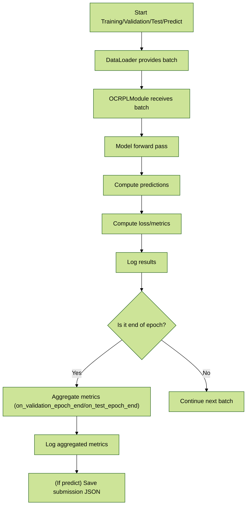

```mermaid
---
config:
  theme: "forest"
---
flowchart TD
    A["Start Training/Validation/Test/Predict"] --> B["DataLoader provides batch"]
    B --> C["OCRPLModule receives batch"]
    C --> D["Model forward pass"]
    D --> E["Compute predictions"]
    E --> F["Compute loss/metrics"]
    F --> G["Log results"]
    G --> H{"Is it end of epoch?"}
    H -- "Yes" --> I["Aggregate metrics (on_validation_epoch_end/on_test_epoch_end)"]
    I --> J["Log aggregated metrics"]
    H -- "No" --> K["Continue next batch"]
    J --> L["(If predict) Save submission JSON"]

```
