# Component Diagrams

## Current Architecture Diagram

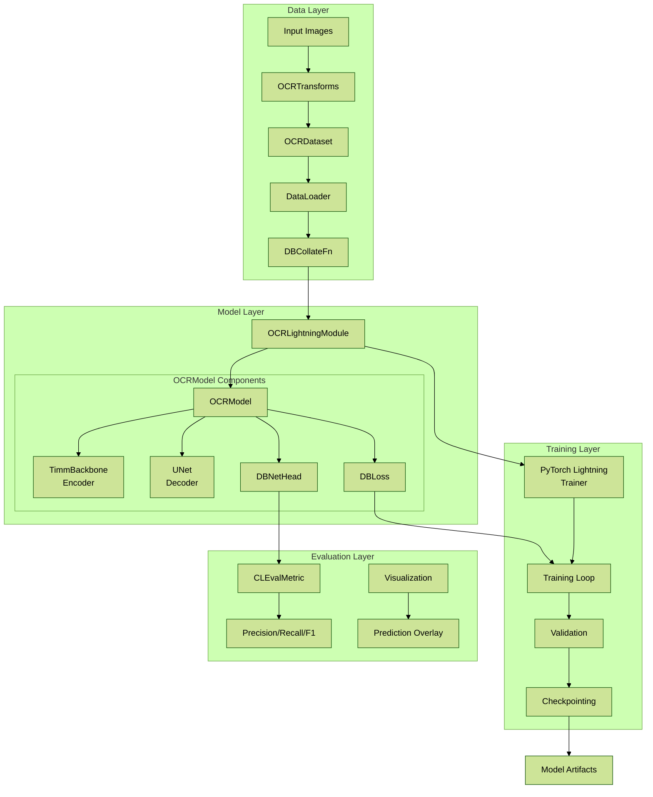

## Plug-and-Play Architecture Diagram

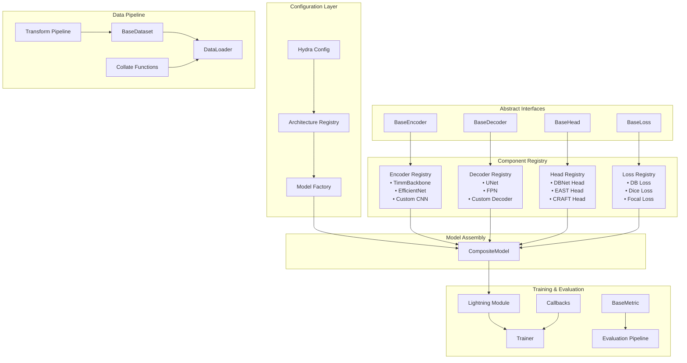

## Component Interface Diagrams

### BaseEncoder Interface

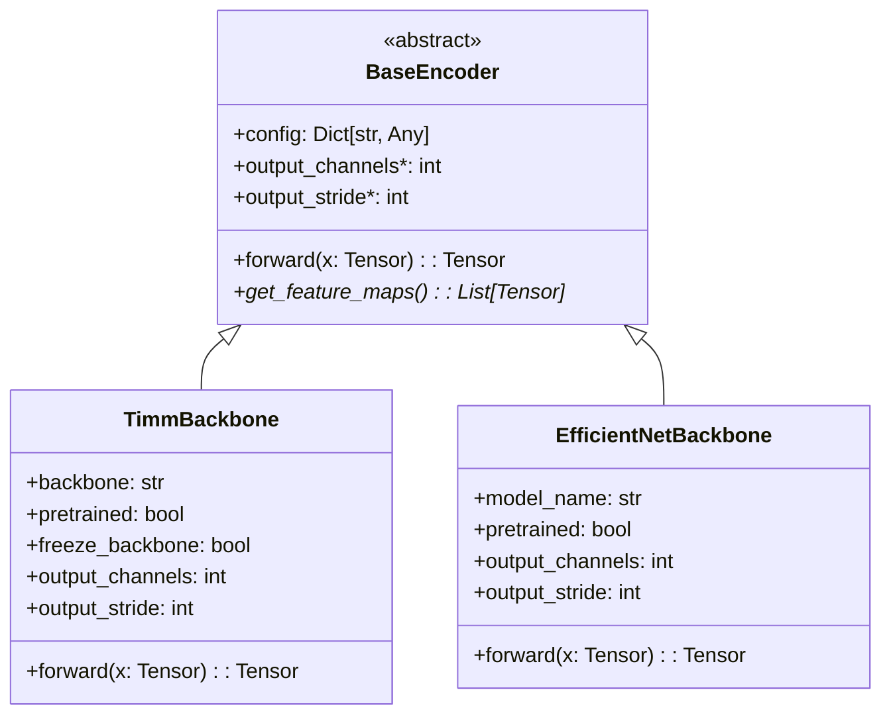

### BaseDecoder Interface

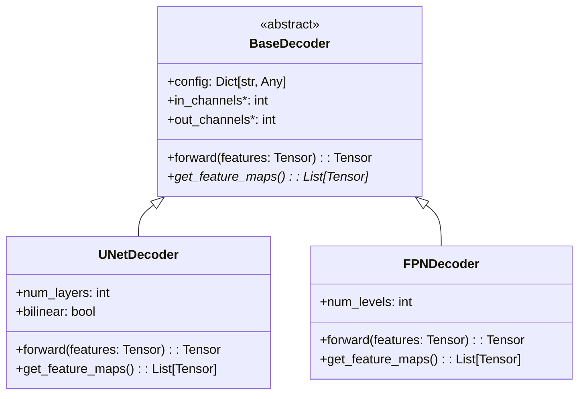

### BaseHead Interface

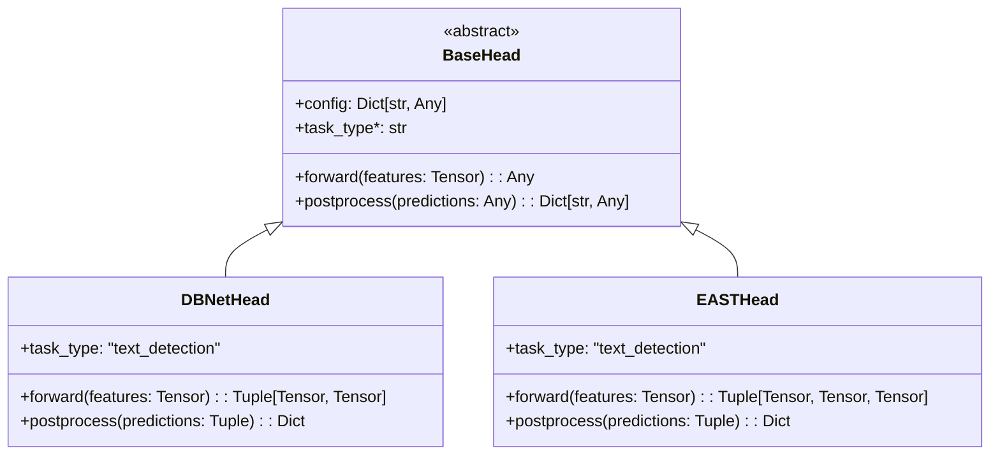

### BaseLoss Interface

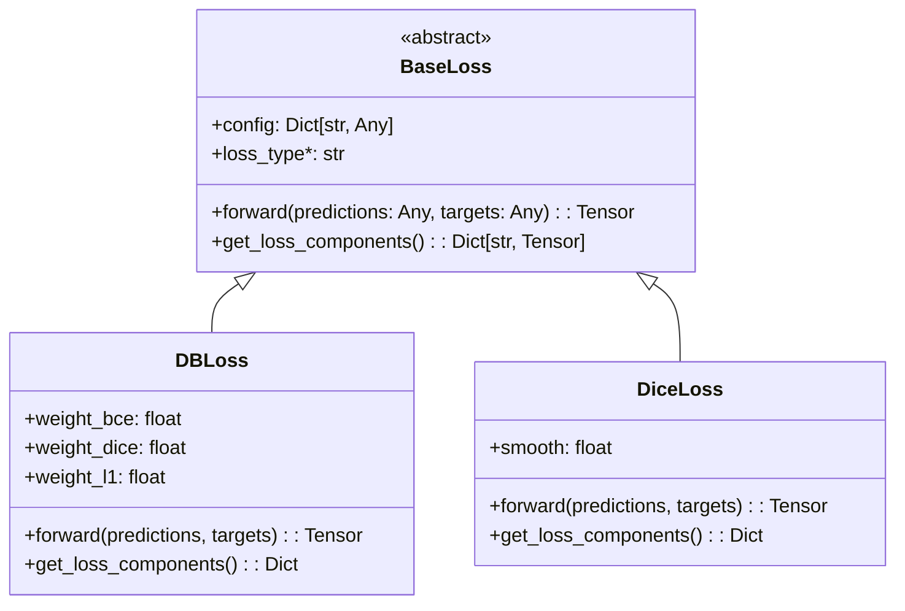

## Data Flow Diagrams

### Training Data Flow

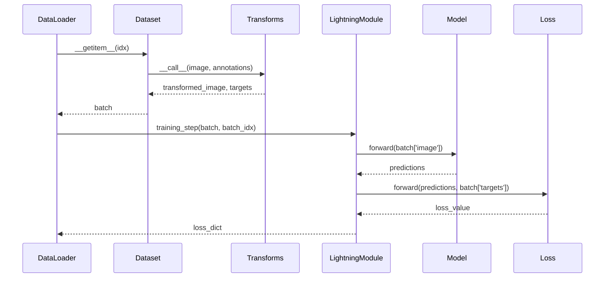

### Inference Data Flow

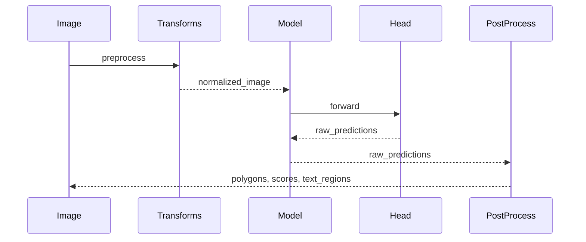

## Configuration Flow

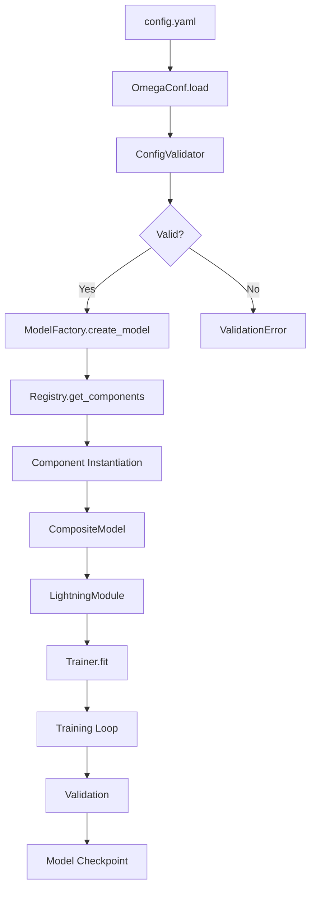

## Registry System Architecture

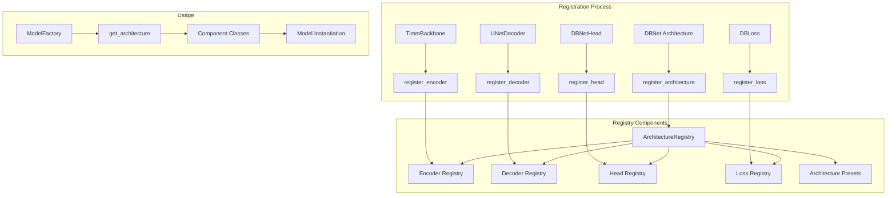

## Experiment Management Flow

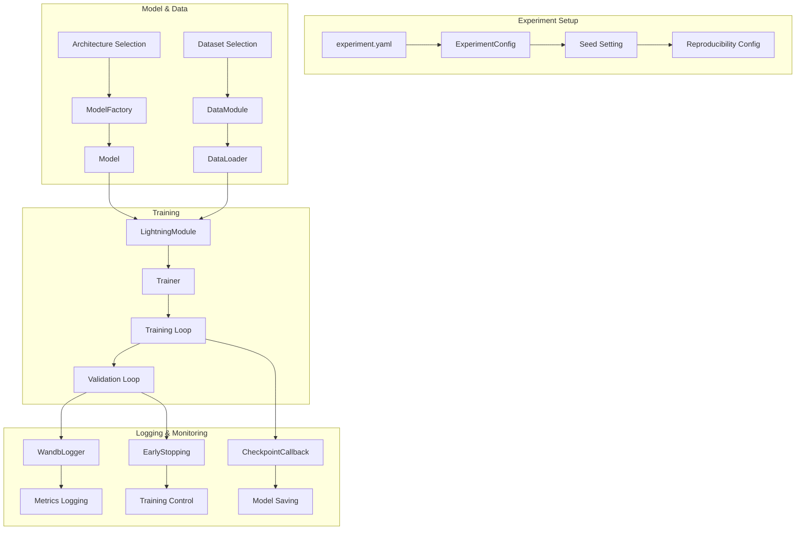

## Component Dependencies

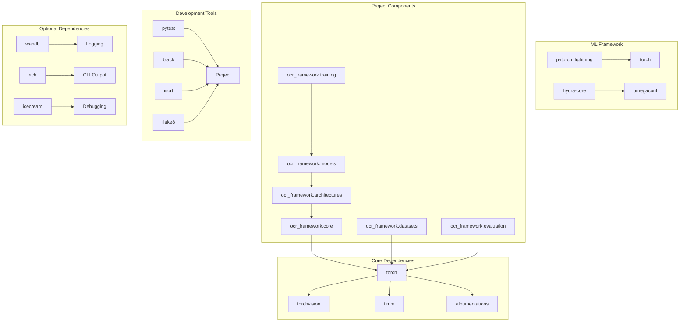

## Error Handling Flow

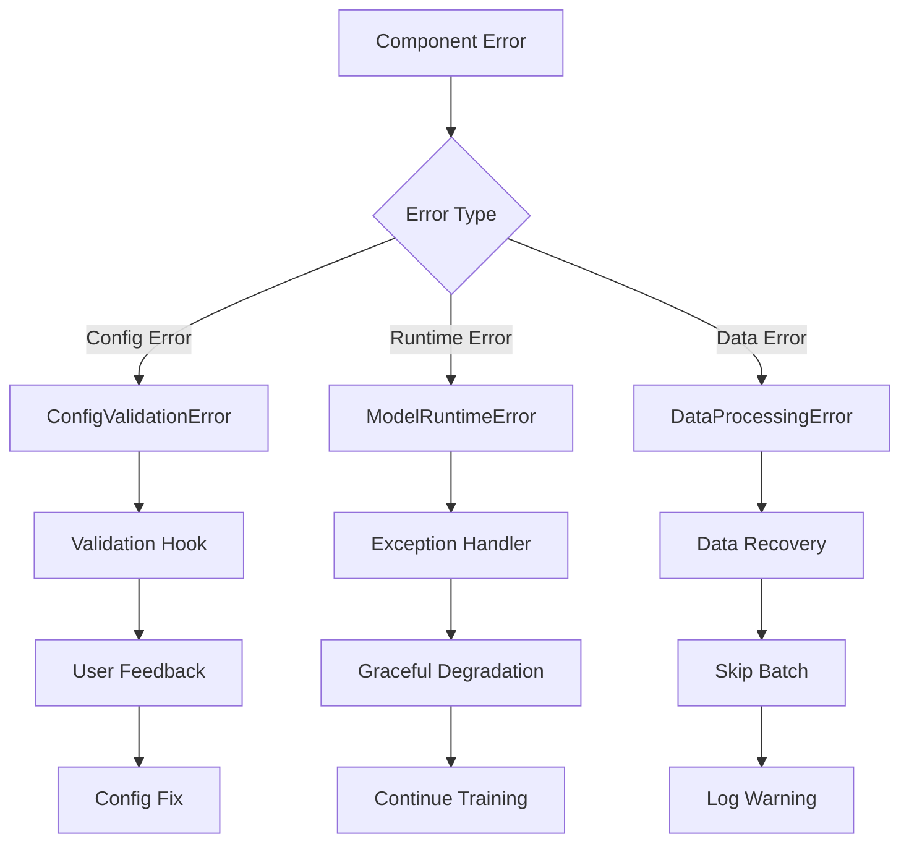

## Testing Architecture

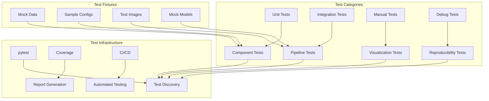

These diagrams provide a comprehensive visual representation of the current architecture and the planned plug-and-play system, showing component relationships, data flows, and system interactions.</content>
<parameter name="filePath">/home/vscode/workspace/upstage-receipt-text-detection-dbnet-baseline/docs/component-diagrams.md
