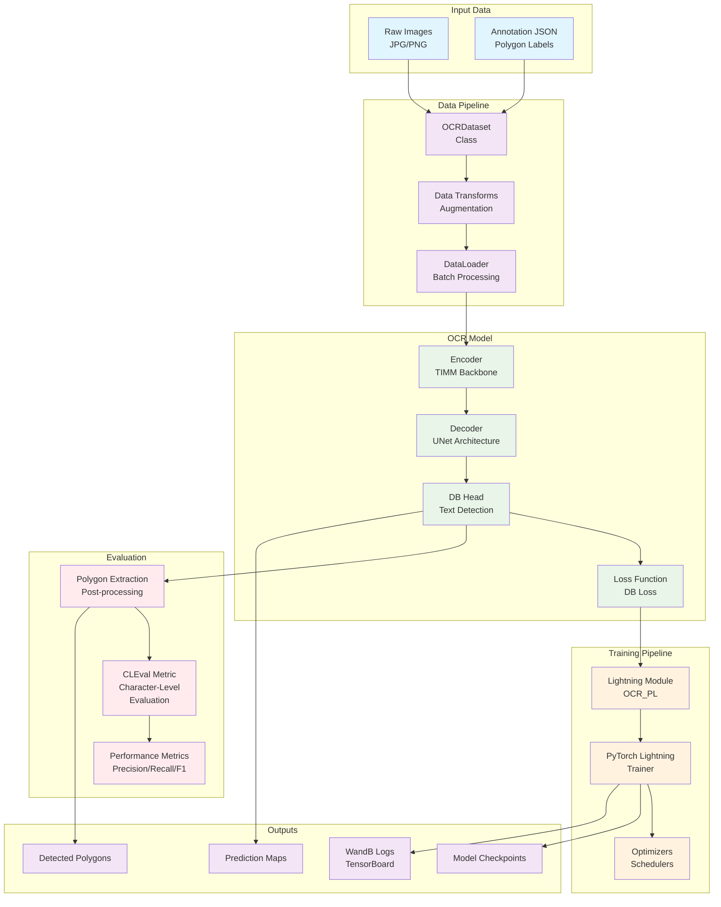
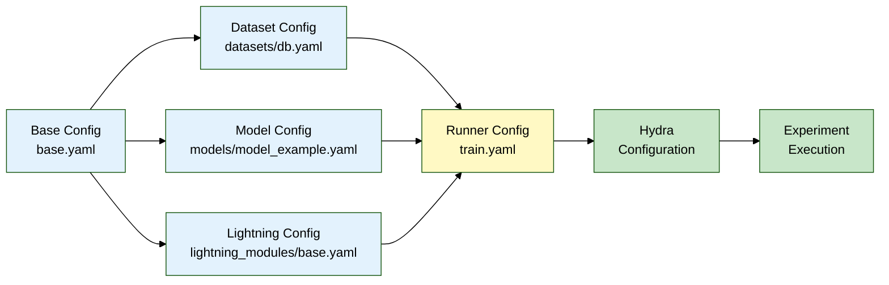

# OCR Pipeline Workflow

## Component Details

### Data Pipeline Flow
1. **Raw Images** → OCRDataset loads and validates image files
2. **Annotations** → JSON files with polygon coordinates for text regions
3. **Transforms** → Albumentations for data augmentation and preprocessing
4. **DataLoader** → PyTorch DataLoader for batch processing

### Model Architecture Flow
1. **Encoder** → TIMM backbone (ResNet, EfficientNet, etc.) extracts features
2. **Decoder** → UNet architecture upsamples features to original resolution
3. **DB Head** → Differentiable Binarization head for text region detection
4. **Loss** → DB Loss combines binary and threshold maps for training

### Training Flow
1. **Lightning Module** → Wraps model with training/validation logic
2. **Trainer** → PyTorch Lightning handles training loop, logging, checkpointing
3. **Optimizers** → Configurable optimizers with learning rate schedulers

### Evaluation Flow
1. **Prediction Maps** → Raw model outputs (probability maps)
2. **Polygon Extraction** → Post-processing to extract text polygons
3. **CLEval Metric** → Character-level evaluation against ground truth
4. **Metrics** → Precision, Recall, F1-score computation

## Configuration Management

## Key Integration Points

- **Hydra**: Configuration management for experiments
- **PyTorch Lightning**: Training framework with built-in features
- **TIMM**: Model zoo for backbone selection
- **Albumentations**: Image augmentation library
- **WandB/TensorBoard**: Experiment tracking and visualization
- **CLEval**: Industry-standard OCR evaluation metric
